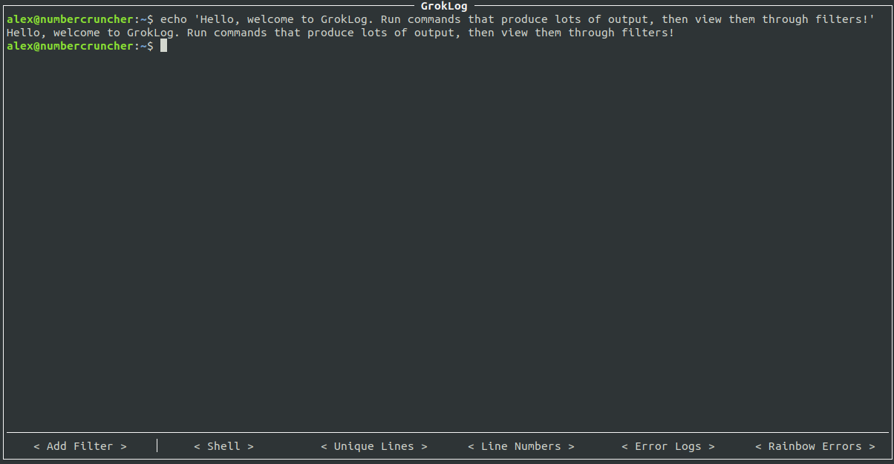

# groklog

GrokLog is a tool for creating "process trees", that is, a root process (an ordinary shell)
has its output piped into the `stdin` of other processes. Those other processes can in 
turn have _their_ `stdout` piped into even more processes. Then, groklog lets you view the 
`stdout` of every process in the tree. 
 
Here's an example of a process tree you could easily create:
```shell
                        Shell
                        ──┬──
                          │  
                          │   The shell stdout and stderr combined
                          │   are piped into subscribing filters.
                          │ 
    ┌─────────────────────┼──────────────────────┐
    │                     │                      │
    ▼                     ▼                      ▼
Name: 'Unique Lines'  Name: 'Line Numbers'   Name: 'Error logs'
Cmd:  'uniq -c'       Cmd:  'cat -b'         Cmd:  'grep -C 10 --line-buffered error' 
                                             ────┬────
                                                 │    The 'Error Logs' stdout+stderr is 
                                                 │    piped to the filter below.
                                                 │
                                                 ▼
                                             Name: 'Rainbow Errors'
                                             Cmd:  'lolcat -f'
```
Each node in the tree is a separate tab in GrokLog, where the output for each command can be viewed individually:


The benefit of all of this is that you can filter logs or other streams using the 
various unix tools you are already familiar with, and do so in a much more sophisticated 
way. 

On top of that, building profiles is quick and easy, so after each configuration change,
everything is saved to a profile. The next time you run groklog you can jump right in 
where you left off!


# Usage
## Install and run
```shell
pipx install groklog
groklog
```

## Profiles
GrokLog saves configuration using a concept of profiles. A profile stores all the 
configuration for a process tree. By default GrokLog loads/creates the `default` profile. 
You can load/create a different profile by running:

```shell
groklog profilename
```

## Controls
When in the `Shell` view, use the shell as you would normally. 

When viewing a filter, use the up/down arrows to move the cursor, or `PgUp`/`PgDn` to skip by
faster. If the widget is out of focus, you may have to click the logs first. 


# Development
## Installation
```shell
poetry install
poetry run pre-commit install
```

## Running tests
```
pytest .
```


# Attributions
1) This code makes heavy use of the fantastic `asciimatics` library for all TUI 
rendering purposes. Some reference code was copied from the 
[terminal.py](https://github.com/peterbrittain/asciimatics/blob/master/samples/terminal.py) 
sample. 

2) Some code was sampled from the OpenVisionCapsules project, specifically for 
   verifying if all threads have been shut down after a unit test. 
[Source file](https://github.com/opencv/open_vision_capsules/blob/master/vcap/vcap/testing/thread_validation.py).

